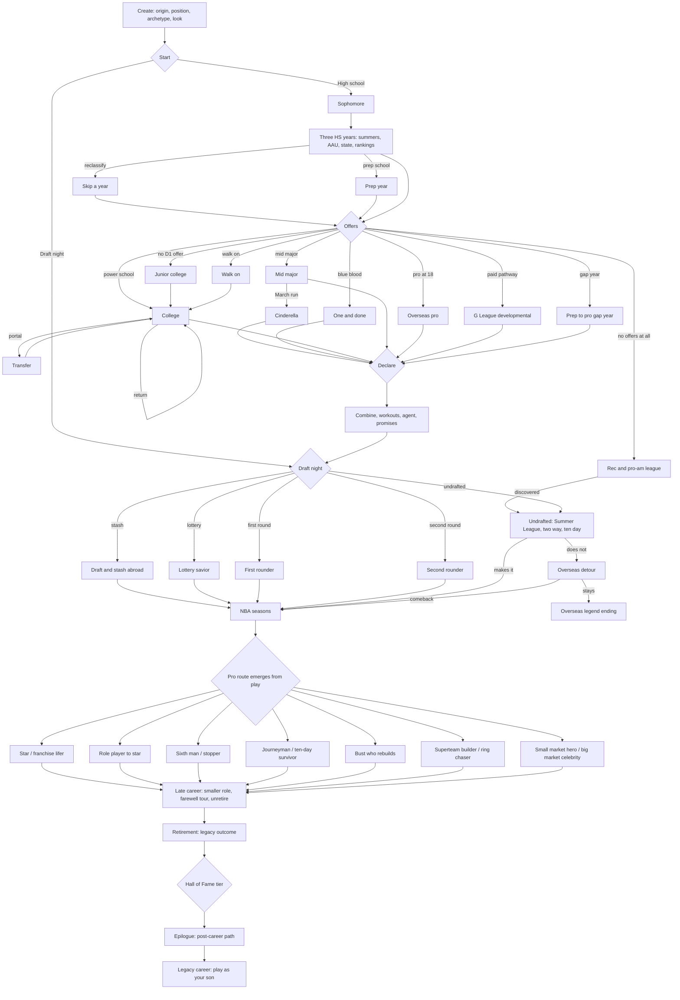

# Run The Floor: Career story bible

Status: **DRAFT for review.** This is the spec the story engine (PLAN.md
Phase C) is built to and the content (Phase D) is written to. The simulator
checks every number in section 9 on every phase.

Legend used in the tables:

- **Stage**: `ori` origin, `hs` high school, `aau` summer circuit, `col` college,
  `juco` junior college, `alt` overseas, G League or gap year before the draft,
  `pre` pre-draft, `dn` draft night, `r` rookie and early career (years 1 to 3),
  `p` prime (4 to 9), `v` veteran (10 and on), `any` any NBA year, `off`
  off-season, `po` playoffs, `ret` retirement, `post` epilogue.
- **Tone**: `R` realistic, `L` legend layer (switchable off).
- **Rarity**: `C` common (most careers), `U` uncommon (one in three), `S`
  scarce (one in ten), `R` rare (one in thirty), `X` mythic (one in a hundred
  or a combination of flags).
- **State** marks what exists today: `E` exists and is kept, `E*` exists and
  is reworked (usually because it puts a real person in drama), `N` new.
- **Who**: `inv` invented people only, `real-bb` a real player or coach may
  appear, in a basketball role only. Every row tagged `drama`, `off` or `L`
  is `inv` by rule, and a guard enforces it.

---

## 1. Principles

1. **Every choice is remembered.** A choice that matters sets a flag, moves a
   relationship, or both. Later text is allowed to reference only flags that
   exist in that career, which the continuity scan proves.
2. **Forks change content, not labels.** Two careers that chose differently
   should share under half their events. Today they share about three
   quarters (AUDIT.md section 3).
3. **Real people stay on the court.** Real players and coaches appear in
   games, rosters, trades, awards, hirings and firings. They never get a
   quote, a feud, a night out, a scandal or a personal life. The drama
   belongs to the invented cast and to three invented teammates seeded into
   every NBA locker room.
4. **Adversity, not misery.** Injuries, slumps, bad money and bad friends are
   in. Nothing graphic, nothing that makes light of real harm. Legal trouble
   is limited to suspensions for basketball and conduct of the
   technical-foul, missed-curfew kind.
5. **The legend layer is a sports movie, not a fantasy novel.** Rare, a little
   heightened, believable inside a film. Off with one switch.

---

## 2. The engine model

An **event** is data:

```
{ id, stage, tone: 'R' | 'L', who: 'inv' | 'real-bb', tags: [...],
  req: { flags, notFlags, traits, rel, age, ovr, fame, money, team, stageAt, ... },
  weight, rarity, cooldown, once, recurs,
  people: { slot: castId | 'mate:inv' | 'mate:real' | 'coach' | ... },
  text, options: [{ label, hint, test?, run: effects, sets: flags, rel: {...}, next: [eventId, delay] }] }
```

- **Prerequisites** read flags, traits, relationships, stage, age, ratings,
  money, team context and league state.
- **Weights** are base weight times modifiers (traits, persona, flags).
- **Cooldowns** in steps; `once` events never repeat; `recurs` events (slump,
  night out) have a cooldown of at least two seasons and a cap per career.
- **Chains**: an option can queue a follow-up after a delay in steps, which is
  how arcs are built.
- **Flags** are namespaced (`col.leftCoach`, `arc.rival.stage`,
  `trait.clutch.known`) and stamped with the year they were set, so a callback
  can say "in 2031".
- **Person ledger**: every named invented person a career meets is stored with
  role, first meeting, meter (-100 to 100) and notes, so the coach you walked
  out on can come back as a head coach.
- **Callbacks**: a library of short lines keyed by flag that any headline,
  press question or verdict can pull ("Still the kid who left Dayton in
  February?").

**Hidden traits** (rolled at creation, weighted by origin, revealed when a
test touches them): clutch, coachable, injury prone, late bloomer, locker
room voice, gym rat, hothead, big stage, glass ankles, iron man, film junkie,
spender, saver, natural showman, introvert, loyal, mercenary. A trait is
shown on the player card only once the career has seen it ("Revealed: Clutch.
Hit three game winners in two seasons.").

**Relationships** (each a meter plus a memory): coach, GM, owner, agent,
trainer, rival, family, hometown friend, best teammate (invented), beat
writer, talk-show critic, shoe executive, superfan, partner.

---

## 3. Route map



Rejoin points are deliberate: every route before the draft rejoins at
`PRE` (or at `UDF` for routes with no draft), and every pro route rejoins at
`LATE`. What does not rejoin is memory: flags set before a rejoin keep
changing content after it.

---

## 4. Origins

Chosen at creation. Each has a creation blurb, a ratings and hidden-trait
tilt, three to five unique events, and its own closing chapter in the career
story and the Hall speech.

| id | origin | tilt | unique events | closing chapter |
|---|---|---|---|---|
| `small_town` | Small-town unknown | IQ up, fame low, loyal likely | `ori_town_paper`, `ori_county_gym`, `ori_scout_lost`, `ori_town_parade` | The town renames the gym, or the road out of town |
| `big_city` | Big-city prodigy | fame high, hothead likely | `ori_mixtape_famous_at_14`, `ori_city_rivalry`, `ori_runner_offer`, `ori_city_tribute` | The city claims him, for better or worse |
| `pro_son` | Son of a former pro (invented father) | IQ and fame up | `ori_fathers_shadow`, `ori_fathers_old_coach`, `ori_beat_his_record`, `ori_father_courtside` | Passing his father, or never escaping him |
| `growth` | Late growth spurt | guard skills, big body later | `ori_six_inches`, `ori_clumsy_year`, `ori_new_position`, `ori_old_jersey_short` | The guard in a big man's body |
| `intl` | International prospect (invented hometown abroad) | IQ and passing up | `ori_national_team_u17`, `ori_language`, `ori_homesick`, `ori_home_federation` | Ambassador or the one who left |
| `prep` | Prep school transfer | polish up, roots weak | `ori_prep_dorm`, `ori_prep_rival_trust_fund`, `ori_hometown_resentment` | Belonging nowhere and everywhere |
| `multi` | Multi-sport athlete | athleticism up, skill raw | `ori_two_sport_choice`, `ori_football_coach_pull`, `ori_draft_by_mlb` | The one who picked basketball |
| `walkon` | Overlooked walk-on type | gym rat likely, ceiling hidden | `ori_cut_from_varsity`, `ori_managers_job`, `ori_earned_scholarship`, `ori_jersey_number_99` | Nobody wanted him, everybody remembers |

---

## 5. Routes

### 5.1 To the pros (14)

| id | route | entry | content it unlocks | rejoins at |
|---|---|---|---|---|
| `r_oad` | One and done | top 25 recruit, blue blood offer | freshman spotlight, declare at 19, NIL bidding | pre |
| `r_four` | Four-year college star | stays through senior year | captaincy, conference POY, senior night, older draft stock | pre |
| `r_midmajor` | Mid-major Cinderella | mid-major commit | Bracket buster arc, upset over a blue blood, the "small school" pre-draft doubt | pre |
| `r_portal` | Transfer portal journey | portal from any college year | new coach, new system, sitting out, the old coach on the schedule | pre |
| `r_juco` | Junior college | no D1 offer or grades | juco gym, a juco coach who believes, D1 offer after one or two years | col |
| `r_walkon` | Walk-on | walkon origin or no offer | practice squad, scholarship earned, cult following | col |
| `r_glid` | G League developmental | rank inside 140, choice | paycheck at 18, NBA coaching, a vet mentor in the G League | pre |
| `r_abroad18` | Overseas pro at 18 | rank inside 90, choice | men's league, a foreign coach, language, the federation | pre |
| `r_gap` | Prep to pro gap year | rank inside 60, choice | train alone, social media brand, scouts forget you | pre |
| `r_undrafted` | Undrafted free agent | draft slide past 60 | Summer League, two-way, ten days | nba |
| `r_stash` | Second-round stash | late second round, choice | a year or two abroad, the call back | nba |
| `r_intl_stash` | International draft and stash | intl origin, drafted | stays home a season, national team, comes over | nba |
| `r_rec` | Late bloomer from a rec or pro-am league | no offers, late bloomer trait | the pro-am viral night, a ten-day, the oldest rookie | nba |
| `r_reclass` | Reclassify | top 40 junior, choice | skip senior year, younger draft age, readiness risk | col |

### 5.2 Through the pros (16)

These are not chosen. They are recognized from play and flags, named in the
career story, and they gate their own events.

| id | route | recognized when | own content |
|---|---|---|---|
| `p_savior` | Lottery savior | top 5 pick to a bottom team | "save the franchise" pressure, the rebuild clock |
| `p_bust` | Bust who rebuilds | high pick, overall under 60 at year 3 | buyout, minimum deal, the second chance, the redemption ending |
| `p_rise` | Role player to star | drafted 20th or later, All-Star later | "where did he come from" press, the max contract |
| `p_sixth` | Sixth man specialist | bench role, top bench scorer | Sixth Man award race, the "start me" debate |
| `p_stopper` | Defensive stopper | twoway, DPOY votes | assignments against stars, the All-Defense case |
| `p_journey` | Journeyman | five or more teams | new city events, the cult hero ending |
| `p_gleague` | G League call-up grinder | two-way or G League years | call-up, sent down, the 10-day ladder |
| `p_tenday` | Ten-day survivor | signed on a ten-day | the hotel room, the second ten-day, rest of season |
| `p_return` | Overseas detour and return | left the NBA for abroad, came back | the euro star, the NBA comeback game |
| `p_lifer` | Franchise lifer | one team, ten seasons | statue arc, the one-team legend ending |
| `p_superteam` | Superteam builder | recruited a co-star | the summer meeting, the backlash, the ring or the breakup |
| `p_ring_chaser` | Mercenary ring chaser | signs with a contender for less | the minimum deal, the bench ring |
| `p_small` | Small-market hero | stays with a small market | city loves you, national media ignores you |
| `p_big` | Big-market celebrity | plays in NY, LA, CHI, BOS, GSW | tabloid layer, the brand, the spotlight cost |
| `p_vet_leader` | Player-coach veteran | age 33 and up, locker room voice | coaching from the bench, the young star you raise |
| `p_unretired` | Unretired | retired and came back | the comeback camp, the one-year deal |

---

## 6. Arcs (44)

Each arc has a setup, at least one escalation, a payoff, and two or more
resolutions. Each step is an event in section 7.

| # | arc | stages | setup → escalation → payoff | resolutions |
|---|---|---|---|---|
| 1 | The rival (Dre Calloway) | hs to ret | `rv_meet` → `rv_same_camp`, `rv_recruit_war`, `rv_draft_night`, `rv_first_matchup`, `rv_trash_talk`, `rv_finals` → `rv_final_word` | friends, enemies forever, teammates late, he wins, you win |
| 2 | Reclassify | hs | `hs_reclass_offer` → `hs_reclass_doubt` → `col_reclass_payoff` | ready early, rushed and buried, back to class |
| 3 | AAU and shoe circuit politics | aau | `aau_two_brands` → `aau_coach_paid` → `aau_choice_sticks` | stay loyal, switch teams, go independent |
| 4 | NIL and collectives | hs, col | `nil_first_check` → `nil_bidding_war` → `nil_collective_calls_due` | take the money, stay put, transfer for it |
| 5 | Recruiting visit gone wrong | hs | `visit_host_trouble` → `visit_photos` → `visit_offer_pulled` | apologize and earn it, go elsewhere, laugh it off |
| 6 | Coach leaves after you commit | hs to col | `commit_signed` → `coach_rumor` → `coach_gone` | stay, follow him, reopen recruitment |
| 7 | Academic eligibility | hs, col | `grades_warning` → `grades_test` → `grades_cleared` | cleared, sit a semester, juco |
| 8 | Draft night slide | dn | `dn_projection` → `dn_green_room_wait` → `dn_slide_end` | walk out with grace, stay with grace, viral face |
| 9 | Draft promise broken | pre, dn | `pre_promise` → `dn_promise_broken` → `r_revenge_game` | grudge, forgiveness, revenge game for ever |
| 10 | Rookie duties | r | `r_rookie_duty` → `r_vet_tests` → `r_vet_embraces` | the room accepts you, it never does |
| 11 | Rookie wall | r | `r_wall_hits` → `r_wall_trainer` → `r_wall_breaks` | breaks through, sent down, broke your body |
| 12 | Summer League breakout | r, off | `sl_first_game` → `sl_viral` → `sl_contract` | guaranteed deal, two-way, overseas |
| 13 | Two-way life | r | `tw_sign` → `tw_days_count` → `tw_converted` | converted, waived, G League MVP |
| 14 | Losing minutes to a veteran | r, p | `min_vet_arrives` → `min_trust_test` → `min_job_back` | win the job, sixth man, ask out |
| 15 | First signature game | r, p | `sig_game_night` → `sig_media_rush` → `sig_expectations` | sustained, one-night wonder, nickname |
| 16 | Showcase weekends | r to p | `asw_rising_stars` → `asw_dunk_invite` / `asw_three_invite` → `asw_contest` | wins, flops, iconic moment |
| 17 | First big purchase | r | `money_first_buy` → `money_family_asks` → `money_lesson` | invested, broke later, house for mom |
| 18 | Trade demand | p | `td_unhappy` → `td_leak` → `td_resolution` | traded, denied, reconcile, sit out |
| 19 | Blockbuster you did not ask for | p | `bb_rumor` → `bb_done` → `bb_return_game` | thrive, sulk, beat them in May |
| 20 | Supermax or team-friendly | p | `max_eligible` → `max_negotiation` → `max_signed` | supermax, hometown discount, walk |
| 21 | No-trade clause standoff | p, v | `ntc_asked` → `ntc_standoff` → `ntc_end` | waive it, block it, bought out |
| 22 | Recruiting a co-star | p | `cs_target` → `cs_summer_meeting` → `cs_decision` | lands, spurns you, lands and it fails |
| 23 | Feud over touches (invented teammate) | p | `touch_tension` → `touch_public` → `touch_end` | one of you traded, truce, best friends |
| 24 | Coach firing fallout | any | `coach_hot_seat` → `coach_fired` → `coach_new_system` | thrives, clashes, blamed |
| 25 | Load management debate | p, v | `lm_rest_night` → `lm_backlash` → `lm_playoffs` | fresh in May, labeled soft, iron man |
| 26 | All-Star snub | p | `snub` → `snub_motivation` → `snub_answer` | next year starter, never again, chip forever |
| 27 | National team | p | `nt_invite` → `nt_camp` → `nt_tournament` | gold, silver, declined |
| 28 | Signature shoe | p | `shoe_meeting` → `shoe_design` → `shoe_launch` | sells out, flops, collectors' cult |
| 29 | MVP race | p | `mvp_ladder_top3` → `mvp_narrative` → `mvp_award` | wins, robbed, voter fatigue |
| 30 | Playoff failure narrative | p | `pf_early_exit` → `pf_label` → `pf_redemption` | redeemed, label sticks, traded for it |
| 31 | Dynasty | p | `dy_back_to_back` → `dy_ego` → `dy_breakup` | three-peat, ego breakup, aging out |
| 32 | Major injury and comeback | any | `inj_major` → `inj_rehab_choice` → `inj_comeback_game` | full return, reinvent, never the same |
| 33 | Misdiagnosis | any | `md_sore` → `md_second_opinion` → `md_truth` | caught early, played through it, lost a year |
| 34 | Confidence crisis | any | `cc_slump` → `cc_counsel` → `cc_return` | therapy and growth, shooting coach, bench |
| 35 | Locker room rift | any | `lr_split` → `lr_meeting` → `lr_outcome` | leader, scapegoat, traded |
| 36 | Contract year | p | `cy_start` → `cy_pressure` → `cy_payday` | paid, flopped, prove-it deal |
| 37 | Booed at home | any | `boo_night` → `boo_media` → `boo_turn` | win them back, ask out, embrace it |
| 38 | Talk-show feud (Bram Talbot) | any | `tv_take` → `tv_clap_back` → `tv_on_set` | truce on air, feud forever, he apologizes |
| 39 | The agent (Sonny Rial) | pre to v | `ag_sign` → `ag_side_deals` → `ag_reckoning` | fire him, he saves you, he sinks you |
| 40 | Business venture | any | `biz_pitch` → `biz_grows` → `biz_outcome` | empire, collapse, sell |
| 41 | Hometown friend (Tavi Price) | ori to post | `hf_drives_you` → `hf_entourage` → `hf_choice` | business partner, cut off, best man |
| 42 | Family | any | `fam_meet` → `fam_milestones` → `fam_court_side` | married, kids, breakup, son plays |
| 43 | Mentor the replacement | v | `mr_rookie_arrives` → `mr_your_minutes` → `mr_handoff` | mentor, rival, both |
| 44 | Farewell | v | `fw_announce` → `fw_tour` → `fw_last_home` | tour, quiet exit, unretire |
| 45 | The cursed franchise (L) | p | `cu_curse_story` → `cu_near_miss` → `cu_broken` | breaks it, curse wins |
| 46 | The lucky item (L) | any | `lk_found` → `lk_streak` → `lk_lost` | keep believing, it was you all along |

---
## 7. Event catalog

Column key: **Rar** rarity, **T** tone, **St** state, **Who** (see top).
"→" in Choices separates a choice from its main consequence. Meters:
H health, Mo mood, F fame, Tr coach's trust, $ money, Ovr ratings.
Relationships are written `+agent`, `-coach` and so on.

### 7.1 Origins (32)

| id | stage | req | choices → consequences | flags set | next | Rar | T | St | Who |
|---|---|---|---|---|---|---|---|---|---|
| ori_town_paper | ori | small_town | Give the interview → F+, +town · Decline → nothing | town.paper | ori_scout_lost | C | R | N | inv |
| ori_county_gym | hs | small_town | Open the gym at 5am → Ovr+, H- · Sleep → Mo+ | trait.gymrat test | | C | R | N | inv |
| ori_scout_lost | hs | small_town, town.paper | Drive to the showcase two states away → rank up, $- · Stay for the town game → +town | town.stayed | | U | R | N | inv |
| ori_town_parade | post | small_town, HOF or title | Ride in it → closing chapter A · Skip it → B | | | C | R | N | inv |
| ori_mixtape_famous_at_14 | ori | big_city | Post it → F++ · Keep it off → coachable test | city.mixtape | ori_runner_offer | C | R | N | inv |
| ori_city_rivalry | hs | big_city | Take the rival school's offer → rival+ · Stay → +friend | city.switched | | U | R | N | inv |
| ori_runner_offer | hs | city.mixtape | Take the "uncle" money → $+, eligibility risk · Refuse → +family | city.runner | arc 7 | S | R | N | inv |
| ori_city_tribute | post | big_city | Mural, court, or nothing → closing chapter | | | C | R | N | inv |
| ori_fathers_shadow | hs | pro_son | Wear his number → F+, pressure · Your own number → Mo+ | son.number | | C | R | N | inv |
| ori_fathers_old_coach | col | pro_son | Play for his old coach → Tr+ · Go your own way → rel father- | son.ownway | | U | R | N | inv |
| ori_beat_his_record | any | pro_son, career pts > father | Call him → +father · Say nothing → it is in the paper anyway | son.passed | | U | R | N | inv |
| ori_father_courtside | any | pro_son | Invite him to the Finals → F+ · Keep him away → Mo+ | | | S | R | N | inv |
| ori_six_inches | hs | growth | Keep playing guard → Pla stays · Move inside → Reb+ | growth.pos | ori_new_position | C | R | E* | inv |
| ori_clumsy_year | hs | growth | Yoga and footwork → Ath+ later · Play through → H- | | | C | R | N | inv |
| ori_new_position | col | growth.pos | Embrace it → archetype shift · Fight it → Mo- | | | U | R | N | inv |
| ori_old_jersey_short | post | growth | Story beat in the Hall speech | | | C | R | N | inv |
| ori_national_team_u17 | hs | intl | Play for the U17s → F+, H- · Rest → Ovr+ | intl.u17 | ori_home_federation | C | R | N | inv |
| ori_language | col | intl | Tutor every night → Mo-, IQ+ · Let the game talk → Mo+ | intl.lang | | C | R | N | inv |
| ori_homesick | r | intl | Fly family over → $- Mo+ · Tough it out → Mo- | | | U | R | N | inv |
| ori_home_federation | p | intl, intl.u17 | Play every summer → F+ H- · Skip a window → federation feud | intl.fedfeud | | U | R | N | inv |
| ori_prep_dorm | hs | prep | Room with the trust fund kid → $ contacts · Room alone → IQ+ | prep.roommate | | C | R | N | inv |
| ori_prep_rival_trust_fund | col | prep.roommate | His father invests in you → biz unlock · Decline → nothing | prep.investor | arc 40 | S | R | N | inv |
| ori_hometown_resentment | any | prep | Go home for a camp → +town · Do not → town- | | | U | R | N | inv |
| ori_two_sport_choice | hs | multi | Basketball only → Ovr+ · Both sports → Ath+, H- | multi.both | ori_draft_by_mlb | C | R | N | inv |
| ori_football_coach_pull | hs | multi.both | The football coach begs → F+ in town · Say no → Tr+ | | | U | R | N | inv |
| ori_draft_by_mlb | dn | multi.both | Turn baseball down for good → closing chapter · Keep it open → agent+ | multi.mlb | | S | R | N | inv |
| ori_cut_from_varsity | hs | walkon | Ask why → coachable reveal · Transfer → small school | walkon.cut | | C | R | N | inv |
| ori_managers_job | col | walkon | Take the manager job to practice → walk-on path | walkon.mgr | r_walkon | U | R | N | inv |
| ori_earned_scholarship | col | walkon.mgr | Scene: the coach calls the team in | walkon.schol | | U | R | N | inv |
| ori_jersey_number_99 | post | walkon | The number nobody wanted, retired somewhere | | | S | R | N | inv |
| ori_big_city_burnout | col | big_city, fame > 60 before 19 | Log off → Mo+ F- · Lean in → F+ Mo- | | | S | R | N | inv |
| ori_intl_federation_ban | p | intl.fedfeud | Settle it → $- · Fight it → miss the national team | | | R | R | N | inv |

### 7.2 High school and the summer circuit (40)

| id | stage | req | choices → consequences | flags set | next | Rar | T | St | Who |
|---|---|---|---|---|---|---|---|---|---|
| hs_summer | hs | each summer | Shoe circuit / skills trainer / team / rest | hs.summer.* | | C | R | E | inv |
| mixtape | hs | | Post it / let the game talk | hs.mixtape | | C | R | E | inv |
| grades | hs | | Study / skip / tutor | grades.* | arc 7 | U | R | E | inv |
| rival_school | hs | | Rivalry game choice | | | U | R | E | inv |
| amclutch | hs, col | tie game in tournament | four shots | clutch test | | C | R | E | inv |
| offers | hs | junior | the offer list | hs.offers | commit | C | R | E | inv |
| commit | hs | offers | pick a school | col.school | arc 6 | C | R | E | inv |
| signing | hs | senior | sign / wait | | | U | R | E | inv |
| class_skip | hs | | skip class / go | | | U | R | E | inv |
| prep_transfer | hs | | transfer to prep / stay | prep.moved | | S | R | E | inv |
| camp_invite | hs | ranked | elite camp / home | | | S | R | E | inv |
| growth | hs | | growth spurt reaction | | | S | R | E | inv |
| coach_son | hs | | coach's son gets the shots | | | S | R | E | inv |
| nooffer | hs | no D1 offer | juco / walk on / prep / rec | route.* | | U | R | E | inv |
| street_agent | hs | ranked | take the meeting / no | hs.streetagent | arc 39 | U | R | E | inv |
| hs_reclass_offer | hs | top 40 junior | Reclassify → age down a year · Stay | hs.reclass | arc 2 | S | R | N | inv |
| hs_reclass_doubt | col | hs.reclass | Ask for more minutes · Take the redshirt | | col_reclass_payoff | S | R | N | inv |
| col_reclass_payoff | col | hs.reclass | Payoff scene: ready or buried | | | S | R | N | inv |
| aau_two_brands | aau | ranked | Two shoe circuits want you: choose one | aau.brand | arc 3 | U | R | N | inv |
| aau_coach_paid | aau | aau.brand | Your AAU coach got a bonus for you → stay / leave / ask | aau.money | aau_choice_sticks | U | R | N | inv |
| aau_choice_sticks | p | aau.brand | The brand you picked is the brand at your shoe meeting | | shoe_meeting | U | R | N | inv |
| aau_peach_jam_night | aau | aau.brand | 40 in front of every scout → rank up | | | S | R | N | inv |
| nil_first_check | hs | ranked inside 150 | Local car dealer deal → $+ · No → nothing | nil.hs | arc 4 | U | R | N | inv |
| visit_host_trouble | hs | offers | Your host takes you to a party → go / stay | visit.party | visit_photos | S | R | N | inv |
| visit_photos | hs | visit.party | Photos surface → apologize / deny | visit.photos | visit_offer_pulled | S | R | N | inv |
| visit_offer_pulled | hs | visit.photos | The offer is pulled unless → earn it back / move on | | | S | R | N | inv |
| coach_rumor | hs | col.school signed | The coach is in talks with a pro team → call him / wait | | coach_gone | U | R | N | inv |
| coach_gone | hs, col | coach_rumor | He left → stay / follow / reopen | col.coachleft | | U | R | E* | inv |
| grades_warning | hs, col | grades.* | One more bad test and you sit → tutor / cheat / transfer | | grades_test | U | R | N | inv |
| grades_test | hs, col | grades_warning | The test (a three-choice skill check) | grades.pass/fail | grades_cleared | U | R | N | inv |
| grades_cleared | col | grades_test | cleared / sit a semester / juco | | | U | R | N | inv |
| rv_meet | hs | always | You meet Dre Calloway at camp → shake hands / talk trash | rival.met, rival.tone | rv_same_camp | C | R | N | inv |
| rv_same_camp | hs | rival.met | Matchup in front of scouts → three shots | rival.hs | rv_recruit_war | C | R | N | inv |
| rv_recruit_war | hs | rival.met | Same school recruits you both → go together / choose against him | rival.school | | U | R | N | inv |
| hs_all_american | hs | rank inside 25 senior | McDonald's-style game (invented name: the Crown Classic) | hs.allam | | S | R | N | inv |
| hs_injury_senior | hs | | Senior-year injury → rehab / play through | inj.hs | | S | R | N | inv |
| hs_dad_coach_clash | hs | pro_son or family | A parent wants to coach from the stands → talk / ignore | | | U | R | N | inv |
| hs_state_title_parade | hs | won state | Ride on the fire truck | hs.statechamp | | S | R | N | inv |
| hs_ranking_drop | hs | rank fell 50+ | Read the comments / go to the gym | | | U | R | N | inv |
| hs_first_dunk | hs | growth or ath > 60 | The first in-game dunk → video | hs.dunk | | C | R | N | inv |

### 7.3 College, junior college and the alternatives (40)

| id | stage | req | choices → consequences | flags set | next | Rar | T | St | Who |
|---|---|---|---|---|---|---|---|---|---|
| training | col | each summer | training plan | | | C | R | E | inv |
| roommate | col | | roommate trouble | | | S | R | E | inv |
| rivalry_col | col | | rivalry game | | | U | R | E | inv |
| booster | col | | booster envelope → take / refuse | col.envelope | investigation | U | R | E | inv |
| investigation | col | col.envelope | tell the truth / lie | | | R | R | E | inv |
| nba_scouts | col | | scouts in the gym → show everything / run the offense | | | U | R | E | inv |
| freshman_wall | col | freshman | the wall | | | U | R | E | inv |
| nil_deal | col | | NIL deal | nil.col | nil_bidding_war | U | R | E | inv |
| coach_leaves | col | | coach leaves | col.coachleft | | U | R | E | inv |
| portal | col | | enter the portal | col.portal | r_portal | U | R | E | inv |
| declare | col | | declare / return | col.declared | | C | R | E | inv |
| summer_league | col, r | | summer league game | | | C | R | E | inv |
| nil_bidding_war | col | nil.col | A rival collective doubles it → transfer / stay / auction | nil.war | nil_collective_calls_due | S | R | N | inv |
| nil_collective_calls_due | col | nil.war, stayed | The collective wants appearances → do them / skip | | | S | R | N | inv |
| col_senior_night | col | four years | Senior night speech | col.senior | | U | R | N | inv |
| col_captain | col | junior or senior | Named captain → +team | col.captain | | U | R | N | inv |
| col_conference_poy | col | best in conference | Award scene | col.poy | | S | R | N | inv |
| col_bracket_buster | col | mid major, 3 seed or worse | Upset a blue blood | col.cinderella | | S | R | N | inv |
| col_one_shining | col | col.cinderella | The run continues to the second weekend | | | R | R | N | inv |
| col_title_game | col | final four | National title game, playable moment | col.title | | R | R | N | inv |
| col_injury | col | | Torn something in February → rehab / medical redshirt | inj.col | | S | R | N | inv |
| col_redshirt | col | col_injury or depth | Redshirt year → Ovr+ age+ | col.redshirt | | S | R | N | inv |
| col_coach_yells | col | | The coach rips you in film → take it / fire back | | | U | R | N | inv |
| col_return_senior | col | junior, mock outside 20 | Come back for senior year → stock test | col.returned | | U | R | N | inv |
| col_portal_new_coach | col | col.portal | The new coach's system → fit test | | | U | R | N | inv |
| col_portal_old_team | col | col.portal | You play your old school → revenge game | col.portalrevenge | | U | R | N | inv |
| juco_gym | juco | route juco | Two-a-days in a gym with no air → Ovr+ Mo- | juco.in | juco_d1_offer | C | R | N | inv |
| juco_d1_offer | juco | juco.in | A D1 offer arrives → take it / stay a second year | juco.d1 | | U | R | N | inv |
| walkon_practice_squad | col | walkon route | Guard the starters every day → Def+ | | ori_earned_scholarship | C | R | N | inv |
| walkon_cult_hero | col | walkon.schol | The student section chants your name | walkon.cult | | S | R | N | inv |
| abr_first_practice | alt | r_abroad18 | Grown men test you → fight / laugh | | | C | R | N | inv |
| abr_coach | alt | r_abroad18 | Your coach plays veterans → wait / ask out | | | U | R | N | inv |
| abr_derby | alt | r_abroad18 | The derby with drums and flares | abr.derby | | U | R | N | inv |
| glid_paycheck | alt | r_glid | First check at 18 → save / spend | money.first | | C | R | N | inv |
| glid_vet | alt | r_glid | An invented 31-year-old vet takes you in | glid.vet | | U | R | N | inv |
| gap_alone | alt | r_gap | Train alone → trainer arc / brand arc | gap.mode | | C | R | N | inv |
| gap_forgotten | alt | r_gap | Mock drafts forget you → post workouts / stay quiet | | | U | R | N | inv |
| rec_proam_night | alt | r_rec | 54 in a pro-am, goes viral | rec.viral | r_undrafted | S | R | N | inv |
| rec_day_job | alt | r_rec | Work or train → $ vs Ovr | | | U | R | N | inv |
| col_draft_combine_invite | col | stock | Combine invite → go / stay in school | | combine | U | R | N | inv |

### 7.4 Pre-draft and draft night (20)

| id | stage | req | choices → consequences | flags set | next | Rar | T | St | Who |
|---|---|---|---|---|---|---|---|---|---|
| combine | pre | | measurements and drills | | | C | R | E | inv |
| workout | pre | | team workouts | | | C | R | E | real-bb |
| agent | pre | | pick an agent (three agents, three ethics) | agent.id | arc 39 | C | R | E* | inv |
| agent_pitch | pre | | agent's pitch | | | U | R | E | inv |
| undrafted | dn | slid past 60 | undrafted options | route.udf | r_undrafted | S | R | E | inv |
| pre_promise | pre | mock 10 to 30 | A team promises to take you → skip other workouts / keep working | pre.promise | dn_promise_broken | U | R | N | real-bb (team only) |
| pre_medical_flag | pre | inj.* | A medical red flag leaks → full disclosure / hide it | pre.medflag | | S | R | N | inv |
| pre_interview_trap | pre | | An invented exec asks a trap question → honest / polished / joke | pre.interview | | U | R | N | inv |
| pre_shooting_coach | pre | sho < 55 | Rebuild your jumper in six weeks → risk / reward | | | U | R | N | inv |
| pre_green_room_invite | pre | mock inside 20 | Accept the green room invite → risk of the slide | dn.greenroom | dn_green_room_wait | U | R | N | inv |
| dn_projection | dn | | Where the mocks have you | | | C | R | N | inv |
| dn_green_room_wait | dn | dn.greenroom, slid 8+ | The camera finds you → stay / walk out | dn.slide | dn_slide_end | S | R | N | inv |
| dn_slide_end | dn | dn.slide | The pick comes → grace / anger, a viral face | dn.viralface | | S | R | N | inv |
| dn_promise_broken | dn | pre.promise, not taken | They pass on you → remember it | grudge.team | r_revenge_game | S | R | N | real-bb (team only) |
| dn_hometown_pick | dn | drafted by HOME_CLUB | The arena goes up | dn.home | | R | R | N | inv |
| dn_traded_on_night | dn | | Draft-night trade → new team before the hat | dn.traded | | U | R | N | real-bb (team only) |
| dn_stash_choice | dn | second round | Stay abroad a year or sign a two-way | route.stash | r_stash | U | R | N | inv |
| dn_jersey_reveal | dn | drafted | Ceremony: the jersey reveal | | | C | R | N | inv |
| dn_mom_hug | dn | family.mom | The hug on camera | | | C | R | N | inv |
| dn_rival_same_night | dn | rival met | Dre goes before or after you | rival.draft | | C | R | N | inv |

### 7.5 Rookie and early career (34)

| id | stage | req | choices → consequences | flags set | next | Rar | T | St | Who |
|---|---|---|---|---|---|---|---|---|---|
| rookie_duty | r | year 1 | rookie duties from the invented vet | | arc 10 | C | R | E* | inv |
| vet_mentor | r | | a vet offers to mentor (now invented vet) | mentor.id | | U | R | E* | inv |
| r_vet_tests | r | rookie_duty | The vet tests you on a road trip | | r_vet_embraces | U | R | N | inv |
| r_vet_embraces | r | r_vet_tests | Payoff scene | room.accepted | | U | R | N | inv |
| r_wall_hits | r | games > 50 year 1 | The rookie wall → rest / grind / trainer | | r_wall_trainer | C | R | N | inv |
| r_wall_trainer | r | r_wall_hits | Nadia Ferro offers a plan | trainer.nadia | r_wall_breaks | U | R | N | inv |
| r_wall_breaks | r | | Payoff: breaks through or broke down | | | U | R | N | inv |
| sl_first_game | r, off | | Summer League opener → hunt shots / run the team | | sl_viral | C | R | N | inv |
| sl_viral | off | 35+ in SL | The clip | sl.viral | sl_contract | S | R | N | inv |
| sl_contract | off | sl.viral, undrafted | Guaranteed deal / two-way / overseas money | | | S | R | N | inv |
| tw_sign | r | route.udf | Sign a two-way | tw.signed | tw_days_count | U | R | N | inv |
| tw_days_count | r | tw.signed | The 50-day count runs low → ask for conversion / wait | | tw_converted | U | R | N | inv |
| tw_converted | r | | Converted / waived / G League MVP | | | U | R | N | inv |
| tenday_hotel | r, any | route ten-day | The hotel room, the second ten-day | tenday.n | | S | R | N | inv |
| gl_callup | r | G League | The call-up text at 1am | | | U | R | N | inv |
| gl_sent_down | r | | Sent down → sulk / dominate | | | U | R | N | inv |
| min_vet_arrives | r, p | | Team signs a vet at your spot (real player, basketball only) | | min_trust_test | U | R | N | real-bb |
| min_trust_test | r, p | | Practice battles for the job | | min_job_back | U | R | N | inv |
| min_job_back | r, p | | You win it / sixth man / ask out | | | U | R | N | inv |
| sig_game_night | r, p | 35+ game | First signature game, scene | sig.game | sig_media_rush | U | R | N | inv |
| sig_media_rush | r, p | sig.game | Every outlet wants you → do it all / one interview | | sig_expectations | U | R | N | inv |
| sig_expectations | r, p | | The next five games test it | | | U | R | N | inv |
| asw_rising_stars | r | top rookie | Rising Stars game | asw.rising | | U | R | N | real-bb |
| asw_dunk_invite | r, p | ath > 75 | Dunk contest invite → accept / decline | asw.dunk | asw_contest | S | R | N | real-bb |
| asw_three_invite | r, p | sho > 75 | Three-point contest | asw.three | asw_contest | S | R | N | real-bb |
| asw_contest | r, p | invite | Playable contest | asw.won | | S | R | N | real-bb |
| money_first_buy | r | first contract | Car / house for mom / invest | money.firstbuy | money_family_asks | C | R | N | inv |
| money_family_asks | r | | Cousins and loans → yes / no / financial adviser | money.family | money_lesson | C | R | E* | inv |
| money_lesson | r, p | | Payoff of the first purchase | | | U | R | N | inv |
| r_revenge_game | r | grudge.team | First game against the team that broke its promise | grudge.game | | S | R | N | real-bb (team only) |
| debut | r | | NBA debut scene | | | C | R | E | real-bb |
| r_road_trip_card_game | r | | Invented teammates' card game → join / sleep | | | U | R | N | inv |
| r_jersey_number_trade | r | your number taken | Buy the number from an invented vet / pick a new one | | | S | R | N | inv |
| r_rookie_of_month | r | strong month | Award | | | U | R | N | real-bb |

### 7.6 Prime (44)

| id | stage | req | choices → consequences | flags set | next | Rar | T | St | Who |
|---|---|---|---|---|---|---|---|---|---|
| trade_rumor | p | | rumor response | | | C | R | E | real-bb |
| extension | p | | extension talks | | | C | R | E | inv |
| fa | off | free agent | free agency | | | C | R | E | real-bb (teams) |
| shoe_deal | p | | shoe deal | shoe.brand | shoe_meeting | U | R | E | inv |
| superteam | p | star | the summer call (now invented agents relay, real clubs only) | | arc 22 | S | R | E* | real-bb (teams) |
| allstar | p | | All-Star | | | U | R | E | real-bb |
| christmas | p | | Christmas game | | | U | R | E | real-bb |
| playoff_guarantee | po | | guarantee a win | | | U | R | E | inv |
| double_team | p | | teams double you | | | U | R | E | real-bb |
| hot_streak | any | | hot streak | | | C | R | E | inv |
| contract_year | p | | contract year | cy.start | arc 36 | U | R | E | inv |
| td_unhappy | p | Mo < 40, losing | Demand a trade → privately / publicly / no | td.demand | td_leak | U | R | N | inv (GM generated) |
| td_leak | p | td.demand | It leaks via Kelvin Shaw | td.leaked | td_resolution | U | R | N | inv |
| td_resolution | p | | Traded / denied / reconcile | | | U | R | N | real-bb (teams) |
| bb_rumor | p | | Blockbuster talks without you | | bb_done | S | R | N | real-bb (teams) |
| bb_done | p | | Traded mid-season → scene, re-theme | traded.blockbuster | bb_return_game | S | R | N | real-bb (teams) |
| bb_return_game | p | traded | First game back in the old arena | | | S | R | N | real-bb (teams) |
| max_eligible | p | ovr > 82 | Supermax eligible | | max_negotiation | S | R | N | inv |
| max_negotiation | p | | Max / hometown discount / walk | max.choice | max_signed | S | R | N | inv |
| max_signed | p | | Scene and receipt | | | S | R | N | inv |
| ntc_asked | p, v | max.choice | Ask for a no-trade clause | ntc.has | ntc_standoff | R | R | N | inv |
| ntc_standoff | p, v | ntc.has, team rebuilding | Team wants you to waive it | | ntc_end | R | R | N | inv |
| ntc_end | p, v | | Waive / block / buyout | | | R | R | N | real-bb (teams) |
| cs_target | p | star, contender ambition | Pick an invented free agent star to recruit | cs.target | cs_summer_meeting | S | R | N | inv |
| cs_summer_meeting | off | cs.target | The meeting at your house | | cs_decision | S | R | N | inv |
| cs_decision | off | | Lands / spurns / lands and fails | cs.landed | | S | R | N | inv |
| touch_tension | p | invented co-star | Shots are down → talk / take more / let him | touch.arc | touch_public | U | R | N | inv |
| touch_public | p | touch.arc | It is on TV → own it / deny it | | touch_end | U | R | N | inv |
| touch_end | p | | Trade / truce / best friends | | | U | R | N | inv |
| lm_rest_night | p, v | age 28+ | Sit a national TV game → rest / play | lm.rest | lm_backlash | U | R | N | inv |
| lm_backlash | p, v | lm.rest | Bram Talbot calls it soft | | lm_playoffs | U | R | N | inv |
| snub | p | top 20, not picked | All-Star snub → post / silence / workout clip | snub.year | snub_answer | U | R | N | inv |
| snub_answer | p | snub.year | Next season response | | | U | R | N | real-bb |
| nt_invite | p | ovr > 80 | National team invite | nt.invite | nt_camp | S | R | N | inv |
| nt_camp | off | | Training camp, roles | | nt_tournament | S | R | N | inv |
| nt_tournament | off | | Gold / silver / declined; playable final | nt.medal | | S | R | E* | inv |
| shoe_meeting | p | shoe.brand | Grant Hollis pitches a signature line | shoe.sig | shoe_design | S | R | N | inv |
| shoe_design | p | | Pick the colorway story | | shoe_launch | S | R | N | inv |
| shoe_launch | p | | Sells out / flops / cult | shoe.result | | S | R | N | inv |
| mvp_ladder_top3 | p | ladder top 3 | Narrative choice: stat line / winning / health | mvp.race | mvp_narrative | S | R | N | real-bb |
| mvp_narrative | p | mvp.race | Talk-show debate segment | | mvp_award | S | R | N | inv |
| pf_early_exit | po | seed 1 or 2, out early | The label starts | pf.label | pf_redemption | U | R | N | inv |
| pf_redemption | po | pf.label | Next playoff run tests it | | | U | R | N | inv |
| dy_back_to_back | po | two titles | Dynasty scene, ego event | dy.on | dy_breakup | R | R | N | inv |

### 7.7 Adversity (36)

| id | stage | req | choices → consequences | flags set | next | Rar | T | St | Who |
|---|---|---|---|---|---|---|---|---|---|
| injury | any | | injury decision | inj.* | | C | R | E | inv |
| injury_tweak | any | | tweak | | | C | R | E | inv |
| rehab_summer | off | | rehab plan | | | U | R | E | inv |
| body_care | any | | body care spend | | | C | R | E | inv |
| slump | any | | slump | | arc 34 | C | R | E | inv |
| stuck | any | | stuck on bench (rewritten: invented teammate forwards the podcast) | | | U | R | E* | inv |
| coach_bench | any | | coach benches you (basketball) | | | U | R | E | real-bb |
| coach_fired | any | | coach fired, the search | | arc 24 | U | R | E | real-bb |
| tank | any | losing | front office tank | | | U | R | E | inv |
| buyout | v | | buyout | | | S | R | E | real-bb (teams) |
| ref_heat | any | | refs | | | C | R | E | inv |
| heckler | any | | heckler | | | C | R | E | inv |
| online_beef | any | | beef with an invented account | | | C | R | E | inv |
| teammate_fight | any | | practice shove (now invented teammate) | | | U | R | E* | inv |
| teammate_touches | any | | wants the ball (now invented teammate) | | arc 23 | U | R | E* | inv |
| rival_trash | any | | trash talk (now Dre Calloway, never a real player) | | | C | R | E* | inv |
| inj_major | any | | Torn ACL or Achilles scene | inj.major | inj_rehab_choice | S | R | N | inv |
| inj_rehab_choice | any | inj.major | Surgery path: conservative / aggressive / experimental | inj.path | inj_comeback_game | S | R | N | inv |
| inj_comeback_game | any | | Comeback game, playable | inj.back | | S | R | N | inv |
| inj_reinvent | v | inj.back, ath dropped | Reinvent: post game / shooter / playmaker | build.reinvent | | S | R | N | inv |
| md_sore | any | | Soreness that will not go away → team doctor / second opinion | md.arc | md_second_opinion | R | R | N | inv |
| md_second_opinion | any | md.arc | The second opinion disagrees | | md_truth | R | R | N | inv |
| md_truth | any | | Caught early / played through / lost a year | | | R | R | N | inv |
| cc_counsel | any | slump twice | Talk to someone → Mo+ over time | cc.help | cc_return | U | R | N | inv |
| lr_split | any | losing, room tension | The room splits → lead / stay out | lr.arc | lr_meeting | U | R | N | inv |
| lr_meeting | any | lr.arc | Players-only meeting | | lr_outcome | U | R | N | inv |
| lr_outcome | any | | Leader / scapegoat / traded | | | U | R | N | inv |
| susp_flagrant | any | hothead | Flagrant 2 → apologize / defend | susp.games | | S | R | N | inv |
| susp_curfew | any | night_out bad | Missed curfew, team suspension | susp.curfew | | S | R | N | inv |
| boo_night | any | bad stretch at home | Booed → cup ear / clap back / ignore | boo.arc | boo_media | U | R | N | inv |
| boo_turn | any | boo.arc | They come back / you ask out | | | U | R | N | inv |
| tv_take | any | fame > 40 | Bram Talbot says you are overrated | tv.arc | tv_clap_back | U | R | N | inv |
| tv_clap_back | any | tv.arc | Respond / ignore / go on the show | | tv_on_set | U | R | N | inv |
| tv_on_set | any | | On his set | tv.resolved | | S | R | N | inv |
| bad_contract_backlash | p, v | big deal, ovr falling | "Worst contract in the league" lists | | | U | R | N | inv |
| ag_reckoning | any | agent.sonny, side deals | Sonny's side deal blows up → fire / defend / renegotiate | agent.fired | | S | R | N | inv |

### 7.8 Off the court (34)

| id | stage | req | choices → consequences | flags set | next | Rar | T | St | Who |
|---|---|---|---|---|---|---|---|---|---|
| night_out | any | | night out (invented teammate organizes) | | | C | R | E* | inv |
| family_money | any | | family asks for money | | | C | R | E | inv |
| investment | any | | investment pitch | | | C | R | E | inv |
| local_ad | any | | local commercial | | | C | R | E | inv |
| charity | any | | charity | | | C | R | E | inv |
| podcast | any | | start a podcast (no real coach content) | media.pod | | U | R | E* | inv |
| docuseries | any | | docuseries (no real coach content) | | | U | R | E* | inv |
| rap_album | any | | rap album | | | U | R | E | inv |
| meet_someone | any | | meet someone | life.partner | | C | R | E | inv |
| propose | any | | propose | | | U | R | E* | inv |
| wedding | any | | wedding | | | U | R | E | inv |
| baby | any | | baby | life.kids | | U | R | E | inv |
| breakup | any | | breakup | | | S | R | E | inv |
| media_day | any | | media day | | | C | R | E | inv |
| hometown_call | any | road career | hometown club calls | | | S | R | E | real-bb (team) |
| homecoming | any | | homecoming game | | | U | R | E | real-bb |
| hf_drives_you | hs | always | Tavi Price drives you to AAU | friend.tavi | hf_entourage | C | R | N | inv |
| hf_entourage | p | friend.tavi, paid | Tavi wants on the payroll → hire / help start a business / no | friend.role | hf_choice | U | R | N | inv |
| hf_choice | p, v | friend.role | Payoff | | | U | R | N | inv |
| biz_pitch | any | $ > 5M | A restaurant, a tech app, sneakers, a team in a minor league | biz.type | biz_grows | U | R | N | inv |
| biz_grows | any | biz.type | Double down / hold / sell | | biz_outcome | U | R | N | inv |
| biz_outcome | any | | Empire / collapse / exit | biz.result | | U | R | N | inv |
| money_broke_warning | any | spender, $ low | Your adviser's warning → listen / ignore | money.warned | | S | R | N | inv |
| money_generational | v | $ huge, saver | Generational wealth scene | money.gen | | S | R | N | inv |
| foundation | p, v | charity twice | Start a foundation → school / court / scholarship | foundation | | U | R | N | inv |
| cameo_movie | p | fame > 60 | A movie cameo | ent.movie | | S | R | N | inv |
| fashion_week | p | fame > 70, big market | Front row → brand line / skip | ent.fashion | | S | R | N | inv |
| game_cover | p | fame > 80 | Video game cover (invented game) | ent.cover | | R | R | N | inv |
| social_mistake | any | | A late night post → delete / double down | social.mistake | | U | R | N | inv |
| social_win | any | | A wholesome viral moment | social.win | | U | R | N | inv |
| union_voice | p, v | locker room voice trait | Run for players' union VP | union.role | | S | R | N | inv |
| family_courtside | any | life.kids | Your kid's first game in the arena | | | U | R | N | inv |
| mom_house | r, p | family.mom | Buy mom a house scene | family.house | | C | R | N | inv |
| hs_jersey_return | v | small_town or big_city | Your old high school retires your number | hs.numret | | S | R | N | inv |

### 7.9 Late career (22)

| id | stage | req | choices → consequences | flags set | next | Rar | T | St | Who |
|---|---|---|---|---|---|---|---|---|---|
| mentor_rookie | v | | mentor the rookie (now an invented rookie) | | arc 43 | U | R | E* | inv |
| young_star | v | | the young star (now invented) | | | U | R | E* | inv |
| load_mgmt | v | | load management | | arc 25 | U | R | E | inv |
| retire | v | | retire or come back | | | C | R | E | inv |
| v_smaller_role | v | age 32+, ovr falling | Accept the bench / fight for minutes / ask out | v.role | | C | R | N | inv |
| v_ring_chase_min | v | no ring, age 33+ | Sign for the minimum with a contender | route.ringchase | | U | R | N | real-bb (teams) |
| mr_rookie_arrives | v | | The team drafts your replacement (invented) | mr.arc | mr_your_minutes | U | R | N | inv |
| mr_your_minutes | v | mr.arc | He is taking them → teach / compete | | mr_handoff | U | R | N | inv |
| mr_handoff | v | | The handoff scene | mr.done | | U | R | N | inv |
| v_last_contract | v | age 35+, FA | One more year: money / ring / first team / home | v.last | | U | R | N | real-bb (teams) |
| v_return_first_team | v | v.last = first | Back where it started | v.home | | S | R | N | real-bb (team) |
| v_play_with_son | v | life.kids, son age 19+, active | Your son is on the roster. Legend layer. | v.son | | X | L | N | inv |
| fw_announce | v | age 36+ or chooses | Announce this is the last year → tour on / quiet | fw.arc | fw_tour | U | R | N | inv |
| fw_tour | v | fw.arc | Road gifts, video tributes | | fw_last_home | U | R | N | real-bb (teams) |
| fw_last_home | v | fw.arc | Final home game, playable final minute | fw.done | | U | R | N | inv |
| v_unretire | post | retired 1 to 3 yrs, ovr > 60 left | The comeback | route.unretired | | S | R | N | inv |
| v_unretire_camp | v | route.unretired | Comeback camp, invented coach | | | S | R | N | inv |
| v_milestone_chase | v | within 5% of a milestone | Chase it / let it come | v.chase | | U | R | N | inv |
| v_old_rival_last | v | rival active | The last matchup with Dre | rival.last | rv_final_word | U | R | N | inv |
| v_vet_minimum_cut | v | | Cut in training camp → overseas / retire / wait | | | S | R | N | inv |
| v_bench_coach | v | locker room voice | The coach asks you to coach a timeout | v.coachy | | S | R | N | inv |
| v_hair_grey | v | age 33 | The first grey hair joke (callback to the sprite greying) | | | C | R | N | inv |

### 7.10 Playoffs, moments and ceremonies (24)

| id | stage | req | choices → consequences | flags set | next | Rar | T | St | Who |
|---|---|---|---|---|---|---|---|---|---|
| clutch | po | series 3-3 | Game 7 last shot (now gated on healthy and on the floor) | g7.* | | U | R | E | inv |
| buzzer | any | | buzzer beater card | | | U | R | E | inv |
| presser | any | after big moments | press conference, tones | rep.* | | C | R | E | inv |
| m_buzzer_beater | any, po | tied or down 2, last 5s | Playable: shot choice and timing | m.buzzer | | U | R | N | inv |
| m_clutch_ft | any, po | fouled, down 1 or tied, under 10s | Playable: two free throws, nerves meter | m.ft | | U | R | N | inv |
| m_final_stop | po | up 1, last possession | Playable: guard the drive | m.stop | | U | R | N | real-bb (opponent star) |
| m_poster | any | ath > 70 | Playable: poster dunk attempt | m.poster | | S | R | N | inv |
| m_chase_block | any | def > 70, ath > 70 | Playable: chase-down block | m.block | | S | R | N | inv |
| m_and_one | any | fin > 70 | Playable: and-one finish | m.andone | | U | R | N | inv |
| cer_allstar_intro | p | allstar | All-Star intro ceremony | | | U | R | N | real-bb |
| cer_awards | off | any award | MVP, DPOY, ROY, 6MOY, MIP ceremony | | | U | R | N | inv |
| cer_ring_night | p | title | Ring night | | | S | R | N | inv |
| cer_banner | p | title | Banner raise | | | S | R | N | inv |
| cer_jersey_retire | post | jersey retired | Number to the rafters | | | S | R | N | inv |
| cer_hof_speech | post | HOF | Speech: three choices of tone, origin chapter | | | U | R | N | inv |
| cer_statue | post | p_lifer, HOF | Statue unveiling | | | R | R | N | inv |
| po_upset | po | lower seed wins | Upset scene | | | U | R | N | real-bb (teams) |
| po_sweep | po | 4-0 | Brooms in the stands | | | U | R | N | inv |
| po_finals_loss | po | lost finals | Finals heartbreak scene | po.finalsloss | | S | R | E | inv |
| po_title | po | won title | Title scene, parade | po.ring | | S | R | E | inv |
| po_finals_mvp | po | title and best | Finals MVP ceremony | po.fmvp | | S | R | N | inv |
| po_elimination_presser | po | eliminated | Presser with tones | | | C | R | N | inv |
| po_road_crowd | po | road game 7 | Crowd scene, momentum | | | U | R | N | inv |
| po_injury_in_playoffs | po | injured | Play hurt / sit | | | U | R | N | inv |

### 7.11 League events (12)

| id | stage | req | choices → consequences | flags set | next | Rar | T | St | Who |
|---|---|---|---|---|---|---|---|---|---|
| lg_lockout | off | 1 in 15 seasons | Lockout: shortened season, union role | lg.lockout | | R | R | N | inv |
| lg_expansion | off | 1 in 20 seasons | Two invented expansion clubs; your team protects or exposes you | lg.expansion | | R | R | N | inv |
| lg_rule_change | off | 1 in 8 | A rule change (four point line in the legend layer; a defensive rule otherwise) | lg.rule | | S | R/L | N | inv |
| lg_inseason_cup | p | yearly | In-season tournament: group, knockout, final | lg.cup | | C | R | N | real-bb (teams) |
| lg_dynasty_forms | any | a club wins twice | The league's dynasty: you face it or join it | lg.dynasty | | U | R | N | real-bb (teams) |
| lg_coach_carousel | off | yearly | Already exists (carousel) | | | C | R | E | real-bb |
| lg_record_broken | any | a league record falls | Headline, records watch | | | S | R | N | inv |
| lg_award_race | any | award ladders | Live races with real competition | | | C | R | N | real-bb |
| lg_trade_deadline | p | yearly | Deadline day ticker | | | C | R | N | real-bb (teams) |
| lg_draft_lottery | off | yearly | Lottery show (if your team is in it) | | | U | R | N | real-bb (teams) |
| lg_new_arena | off | rare | Your team moves to a new arena | | | R | R | N | inv |
| lg_relocation | off | very rare | An invented relocation saga for your club; legend layer | | | X | L | N | inv |

### 7.12 The legend layer (24)

All `inv`, all tagged `L`, all off when the legend switch is off.

| id | stage | req | choices → consequences | flags set | next | Rar | T | St | Who |
|---|---|---|---|---|---|---|---|---|---|
| lg_ellis_summer | hs, col | summer, any | Old Man Ellis at the park teaches you a move → signature move unlock | legend.ellis | lg_ellis_return | R | L | N | inv |
| lg_ellis_return | any | legend.ellis | Ellis shows up at your biggest game | | | R | L | N | inv |
| lg_lucky_item_found | any | | A pair of old socks, a coin, a lucky towel | legend.lucky | lg_lucky_streak | S | L | N | inv |
| lg_lucky_streak | any | legend.lucky | It seems to work → believe / laugh | | lg_lucky_lost | S | L | N | inv |
| lg_lucky_lost | any | legend.lucky | It is gone before Game 7 | | | S | L | N | inv |
| lg_curse_story | p | team with longest title drought | The curse is real, says the city | legend.curse | lg_curse_near | R | L | N | inv |
| lg_curse_near | po | legend.curse | So close, in the strangest way | | lg_curse_broken | R | L | N | inv |
| lg_curse_broken | po | legend.curse, title | The curse breaks | legend.cursebroken | | X | L | N | inv |
| lg_cult_movie | p | ent.movie | Your bad movie becomes a cult classic | legend.cult | | R | L | N | inv |
| lg_rival_childhood | p | rival met | Dre was your teammate at age 9 and you both forgot | legend.dre9 | | X | L | N | inv |
| lg_owner_billionaire | p | invented ownership | Victor Lazlo buys your team, makes demands | legend.lazlo | lg_owner_demand | R | L | N | inv |
| lg_owner_demand | p | legend.lazlo | Wear his colorway, play his nephew, sing the anthem | | | R | L | N | inv |
| lg_legends_exhibition | v | HOF probable | A one-off against an invented all-time team | legend.exhibition | | X | L | N | inv |
| lg_midnight_pickup | any | | A midnight run at a park goes viral | legend.midnight | | R | L | N | inv |
| lg_mascot_feud | any | | The mascot started it | legend.mascot | | R | L | N | inv |
| lg_upstart_league | p | max eligible | The Apex League offers double → stay / jump for a season | legend.apex | lg_apex_return | X | L | N | inv |
| lg_apex_return | p | legend.apex | Back in the NBA, booed everywhere | | | X | L | N | inv |
| lg_dream_what_if | po | crushing loss | The what-if dream: replay the shot | legend.dream | | R | L | N | inv |
| lg_fortune_teller | r | | A fortune teller in a road city | legend.fortune | | R | L | N | inv |
| lg_number_ghost | any | | Every jersey number you wear goes to the Finals | legend.number | | X | L | N | inv |
| lg_streetball_tour | off | | A summer streetball tour as a masked player | legend.mask | | R | L | N | inv |
| lg_comet_season | p | | A season where nothing misses (temporary rating surge) | legend.comet | | X | L | N | inv |
| lg_retired_jersey_ghost | v | | A stranger in your retired jersey at every game | legend.ghost | | X | L | N | inv |
| lg_one_more_shot | post | retired, legend on | Fifty years old, one shot at halftime, playable | legend.halftime | | R | L | N | inv |

**Catalog total: 362 events.** 92 rows reuse what exists today (the 88
engine events plus four existing scenes), 18 of them reworked for the
real-people rule; 270 are new. Arcs: 46. Legend layer: 26 events.

---

## 8. Endings and post-career

An ending is a **legacy outcome** (what the career was) plus a **Hall tier**
(what the voters did). Each has its own scene, a written summary built from
flags, and a Vault card. Then an **epilogue** is played.

### 8.1 Hall of Fame tiers (6)

| id | tier | unlock |
|---|---|---|
| hof_first | First ballot | legacy score 85+ |
| hof_eventual | Eventual | 55 to 84, inducted after 1 to 4 ballots (simulated) |
| hof_debate | Borderline debate | 40 to 54, a talk-show debate decides; 50% in |
| hof_snub | Snubbed | 40 to 54 and the debate goes against you |
| hof_committee | Veterans' committee years later | snubbed, then 20 years later if a flag like a title or a record holds |
| hof_none | Not a Hall of Famer | under 40 |

### 8.2 Legacy outcomes (18)

| id | outcome | unlock |
|---|---|---|
| lo_goat | In the GOAT debate | top 3 on the GOAT ladder |
| lo_statue | One-team legend with a statue | p_lifer and HOF |
| lo_jersey | Jersey retired | 7+ years, score 36+ (exists) |
| lo_ringless | The ringless great | HOF, 0 rings |
| lo_playoff_hero | Playoff hero | 3+ playoff moments made, Finals MVP |
| lo_cult_hero | Journeyman cult hero | p_journey, fame high |
| lo_cut_short | What could have been | major injury before 27, retired by 30 |
| lo_bust | Bust | top 5 pick, never above 65 |
| lo_redemption | Redemption story | p_bust then All-Star or title |
| lo_villain | The villain who was right | Villain persona and 2+ rings |
| lo_elder | Beloved elder statesman | p_vet_leader, Pro's pro persona |
| lo_sixth | Greatest sixth man | 3+ Sixth Man awards |
| lo_stopper | The stopper | 3+ DPOY |
| lo_overseas_legend | An NBA cup of coffee, a legend abroad | left for good via detour |
| lo_never | Never made the league | no NBA games (exists) |
| lo_glue | The glue guy with four rings | 4+ rings, never an All-Star |
| lo_hometown | Hometown hero | played most years for HOME_CLUB |
| lo_superteam | The one who built it | p_superteam, title |

### 8.3 Secret endings (10)

| id | ending | flags |
|---|---|---|
| sx_full_circle | Full circle | walkon origin, HOF first ballot, number 99 retired |
| sx_father_son | Two names on the banner | pro_son, passed his father, son drafted in the legacy career |
| sx_curse | The curse breaker | legend.cursebroken |
| sx_dre | Two kids from camp | rival ended as friends, both HOF, legend.dre9 |
| sx_ellis | The student | legend.ellis, signature move won a Finals game |
| sx_apex | The one who came back | legend.apex, title after return |
| sx_town | The gym has your name | small_town, town.stayed, HOF |
| sx_mascot | Mascot's best friend | legend.mascot resolved friendly, jersey retired |
| sx_comeback | Fifty and still splashing | legend.halftime made |
| sx_unretired_ring | Unretired, then ringed | route.unretired, title after |

Endings total: 6 tiers + 18 outcomes + 10 secret = **34**.

### 8.4 Epilogues (14 post-career paths)

Each is a short playable chapter: three to five cards, one scene, its own
closing line.

| id | path | unlock |
|---|---|---|
| ep_head_coach | Head coach | IQ high, coachable, or v_bench_coach |
| ep_assistant | Assistant who works up | any; leads to head coach at 3 cards |
| ep_gm | Front office and GM | IQ high, biz success |
| ep_owner | Team owner (invented ownership group) | money.gen |
| ep_broadcaster | Broadcaster | fame high, media flags |
| ep_league_exec | League executive | union.role |
| ep_college_coach | College coach at your school | col.senior or col.captain |
| ep_hs_coach | High school coach at home | small_town or loyal |
| ep_business | Businessman | biz.result empire |
| ep_actor | Actor | ent.movie or legend.cult |
| ep_politics | Politician (local office, invented) | fame high, foundation |
| ep_family | A quiet family life | life.kids, low fame wish |
| ep_comeback | A comeback attempt | v_unretire unlock |
| ep_podcast | The podcast empire | media.pod |

---

## 9. Recurring cast (14)

Invented people. Names are fixed so they become familiar across careers;
the relationship and the arc are per career.

| who | role | personality and voice | arc |
|---|---|---|---|
| Dre Calloway | the childhood rival | loud, gifted, insecure; talks in hashtags | from camp to the Hall speech (arc 1) |
| Tavian "Tavi" Price | the hometown best friend | loyal, broke, funny; calls you by your middle-school nickname | arc 41 |
| Ed Vickers | AAU coach | hustler with a heart; "the shoe money keeps the gym open" | arc 3, shows up at draft night |
| Sonny Rial | agent with questionable ethics | charming, fast, always on two phones | arc 39 |
| Maya Okonkwo | the straight agent | quiet, exact, hates surprises | the alternative to Sonny |
| Kelvin Shaw | beat writer, The Floor Wire | fair, dry, keeps receipts | leaks, rumors, the career obituary |
| Bram Talbot | talk-show critic, Hot Take Hour | loud, wrong half the time, never sorry | arc 38 |
| June Kimura | press room host (exists in scenes) | professional, a little wry | the presser voice |
| Rocco Vance | play-by-play (exists in scenes) | big calls, old school | every playable moment |
| Big Lou Petrakis | superfan, front row | heckles, then cries at your jersey retirement | callbacks for 15 seasons |
| Nadia Ferro | trainer | blunt, science first | rookie wall, injuries, longevity |
| Grant Hollis | shoe executive, Stride Athletics | slick, data-driven | shoe arc 28 |
| Victor Lazlo | eccentric billionaire (legend) | grand, strange demands | owner arc |
| Old Man Ellis | streetball figure (legend) | says little, sees everything | the summer and the return |

Families and relationships (mom, partner, kids) stay generated per career, as
today.

---

## 10. Balance targets

Measured by the simulator over 3,000 careers, half from high school and half
from draft night, with the random policy plus four scripted policies. Bands
are where the number has to land; outside the band is a failure.

| measure | target band |
|---|---|
| reaches the NBA (HS start) | 85 to 95% |
| route to the pros: college (any) | 55 to 70% |
| route: juco or walk-on | 4 to 10% |
| route: G League, overseas or gap year | 8 to 18% |
| route: undrafted or rec league | 4 to 10% |
| lottery pick | 20 to 32% |
| second round or undrafted | 30 to 45% |
| All-Star at least once | 22 to 35% |
| MVP at least once | 1 to 3% |
| a ring | 18 to 30% |
| Hall of Fame (all tiers in) | 18 to 28% |
| first ballot | 5 to 10% |
| GOAT debate ending | 0.3 to 1% |
| a secret ending | 1 to 4% |
| a legend event (switch on) | 30 to 45% of careers see at least one |
| a legend event (switch off) | exactly 0% |
| distinct events per career | 70 to 110 |
| any one event dealt twice in a career (non-recurring) | 0 |
| recurring events per career | each at most its cap |
| two random careers' event overlap | under 50% (today: 76%) |
| median career length (NBA) | 11 to 14 seasons |
| events never dealt in 3,000 careers | 0 |
| continuity scan failures | 0 |
| real token in an inv-only event | 0 |

---

## 11. Real-people rules, enforced

- Tokens are typed: `{mate:real}`, `{coach:real}`, `{opp:real}` against
  `{mate:inv}`, `{rival}`, `{cast:*}`.
- A guard reads every event's tags and every string: a real token in an event
  tagged `drama`, `off`, `legend`, or in any quoted speech, fails the build.
- Every NBA locker room carries three invented teammates (seeded per club and
  season, generated names, plausible roles) who carry teammate drama.
- Real coaches make basketball decisions on screen (minutes, plays, praise of
  play, benching, being hired and fired). They are never quoted on a personal
  matter and never the subject of gossip.
- Owners are invented ("ownership", or a generated name), never a real owner.
