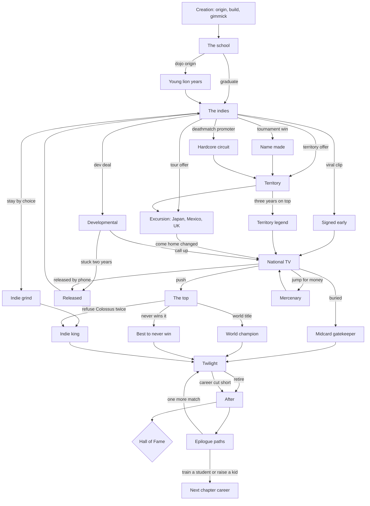

# Run The Ropes: story bible

How a career is told: who is in it, what the paths are, what every event does, how a career
ends, and how often each thing should happen. This is the reference the story engine (PLAN
phase C) is built to, and the event catalog in section 9 is its content list.

Status: **a proposal awaiting review.** Nothing here is in the game yet, except where a row
says it extends an existing scene.

---

## 1. The two layers

Every career runs on two layers at once, and most decisions help one and cost the other.

| | kayfabe (what the fans see) | real (what the boys know) |
|---|---|---|
| measures | popularity, alignment and crowd lean, feud heat, momentum, titles, match quality | money, health and wear, backstage standing, the push, contract, relationships, hidden traits, reputation for reliability |
| who reads it | the crowd, commentary, the dirt sheet's front page, fan signs | bookers, owners, the locker room, the agent, the ring doctor, the dirt sheet's back page |
| typical trade | cutting a scathing promo on the promoter (pop up, standing down) | taking the short pay quietly (standing up, pride down) |

Decision cards tag each option **Kayfabe** or **Real** so a player can see which layer it
spends.

## 2. Career stages

| id | stage | typical age | where |
|---|---|---|---|
| S0 | The school | 18 to 21 | a wrestling school, before a first match |
| S1 | The indies | 21 to 25 | bingo halls, armories, car parks |
| S2 | The territory | 23 to 28 | a regional promotion with local TV |
| S3 | Abroad or developmental | 23 to 29 | a long excursion, or a big company's training brand |
| S4 | National TV | 25 to 33 | weekly television, a brand, a roster spot |
| S5 | The top | 27 to 38 | main events, world titles, supershows |
| S6 | Twilight | 34 and up | slowing down, the next generation, one more run |
| S7 | After | any | the Hall, the epilogue, the next chapter |

A career does not have to pass through every stage in order. An excursion can come before a
territory, a viral moment can skip S2, and a release can drop an S4 wrestler back to S1.

## 3. Memory: flags, meters, traits

**Flags** are permanent facts, written once, read forever. Naming:

| prefix | meaning | example |
|---|---|---|
| `o_` | origin | `o_secondgen`, `o_luchador` |
| `r_` | a route taken | `r_excursion_jp`, `r_dev_callup` |
| `k_` | a kayfabe fact | `k_turned_heel_y3`, `k_won_world`, `k_catchphrase_over` |
| `x_` | a real fact | `x_stiffed_dues`, `x_sat_out_contract`, `x_shoot_interview` |
| `p_` | a promise or debt | `p_owes_sal`, `p_promised_ruth_return` |
| `a_` | arc progress | `a_promoter_short.2` |
| `l_` | legend layer | `l_cursed_belt_held`, `l_masked_opponent_seen` |

**Relationships** are two meters per person, as the game already does: **respect** (do they
rate you) and **heat** (are they against you), each 0 to 100, plus a short memory list of the
three most important things you did to them. An event can require a meter, move a meter, and
write a memory line that later events quote.

**Hidden traits** start unknown and are revealed by play (the first time one fires, a toast
says so):

| trait | revealed when | opens |
|---|---|---|
| natural on the mic | three promos land above 80 | promo events, the commentary route |
| safe worker | 40 matches with no opponent injury | trust events, the producer route |
| glass body | a third injury before 30 | rehab arcs, "what could have been" endings |
| big match performer | a supershow match over 4.5 stars | dream matches, main event pushes |
| locker room leader | 6 rookies helped | the leader arc, the trainer route |
| politician | 4 office asks granted | backstage events, the authority figure route |
| hothead | 3 backstage confrontations | fight and suspension events |
| iron man | 300 matches without a layoff | the streak arc |
| crowd reader | 10 matches where the crowd swung | turn events land better |
| money player | 5 merch milestones | business events, the promoter route |
| ring general | 25 matches rated well with a green opponent | "made everyone better" ending |
| bad luck | a randomly rolled trait, rare | the legend layer leans on it |

## 4. The cast

Invented people who can follow a career from the school to the Hall. Each has a voice, a
default arc, and a reaction to yours. They live beside the 43 wrestlers already in
`world.js` and the nine bookers already in the game (Digger Hoyt, Sabine Ortega, Big Boone
Talbert, Vic Sunday, Naoko Kishi, Aaron Fell, Ren Takahashi, El Cronista Rivas, Ellis
Reeve), who keep their companies and voices.

| who | role | voice | their own arc | how they react to you |
|---|---|---|---|---|
| **Ruth Castellano** | your first trainer, runs the Iron Gate school | blunt, four words where ten would do | the school struggles, she retires and hands the keys to someone | respects work, hates shortcuts; quoted at your Hall speech |
| **Dax Rowan** | your classmate, then your great rival | cocky, quick, secretly insecure | rises in parallel, peaks once, then a choice: friend or enemy for life | mirrors you; if you go up he goes up a company behind or ahead |
| **Tig Moreno** | your tag partner | the funniest person in any car | a bad knee, then a solo career or a reunion | loyal until you outgrow him; remembers who left whom |
| **Sal Fontaine** | carny indie promoter, owns Grit City Wrestling | fast, cheap, charming, calls everyone kid | broke, then sells the company, then turns up as a booker somewhere big | how you handled his short pay decides how he books you years later |
| **Imogen Hale** | visionary booker | cerebral, plans in years | rises to head of creative, is fired, starts her own company | builds long stories around wrestlers who trust her |
| **Conrad Vexley** | owner of Colossus | clipped, corporate, never raises his voice | loses a TV deal, faces a billionaire rival, sells or doubles down | sees you as a number until you draw one |
| **Earl Bishop** | the veteran who runs the room | old school, a rule for everything | wants one last match with someone who respects the business | the locker room meter is largely his opinion |
| **Lionel Sharpe** | a manager, "The Mouthpiece" | florid, a carnival barker in a good suit | collects clients; sometimes sells one out for a better one | can double your promo power or cost you a title |
| **Dale Pruitt** | dirt sheet writer, The Ropes Report | snide, smug, often right | a scoop that ruins a career, an apology or a lawsuit | prints what you leak; prints worse if you freeze him out |
| **Gus Pettibone** | play by play commentator | loud and warm on a good night, cutting on a bad one | the voice of the company, calls one last big match | his calls are your legacy's soundtrack; his tone follows his respect for you |
| **Doris Kettering** | a superfan from the bingo hall | earnest, hand lettered signs | follows the career across the country on buses | her sign appears at every major moment; she is in the front row at the Hall |
| **Marty Klein** | your agent | smooth, unflappable, takes fifteen percent | is he skimming? a mid career reveal | finds the money, sometimes at a price |
| **Dr. Anika Rao** | ring doctor | calm, honest, will not lie to clear you | the toll the job takes on the people who patch it | decides when you are cleared; her warnings are canon |
| **Benny Ocampo** | senior referee | dry, by the book until he is not | the ref bump angle, his own retirement | a ref who trusts you counts a little slower |
| **Jess Varga** | a rookie, later your student | hungry and green | your mirror twenty years on | inherits your finisher, or your enemies |
| **Nell** | your sister at home | a phone call, never a speech | a life you are missing; a wedding, a kid | the family pull home; the quiet family life ending |

**Legend layer cast** (only when the legend layer is on):

| who | what |
|---|---|
| **The Hermit of Calloway Ridge** | an old trainer living in the mountains who teaches one forbidden move |
| **Augustus Thorne** | an eccentric billionaire who starts a rival company and wants you as its face |
| **El Fantasma Sin Nombre** | a masked mystery opponent whose identity is a career long question |
| **Clutch the Condor** | the company mascot, who is somehow a heel |
| **The Archivist** | a strange fan with a time capsule tape of a legend in his prime |

## 5. Origins

Chosen at creation. Each gives a starting stat lean, two or three unique events, a unique
opening scene, and a unique closing paragraph in the epilogue.

| id | origin | starts with | unique content |
|---|---|---|---|
| `o_secondgen` | second or third generation | the family name (pop +8), a parent's old rival in the business | living up to the name; the parent at ringside; "carry the name" ending |
| `o_amateur` | amateur wrestling standout | technique +8, charisma minus 4 | learning to work for a crowd instead of a referee; a college coach who disapproves |
| `o_football` | former football player | power +8, ring IQ minus 4 | a scout who "knows a star when he sees one"; the body takes bumps differently |
| `o_bodybuilder` | bodybuilder | power +6, look +6, cardio minus 6 | the push for the look; gassing in long matches |
| `o_backyard` | backyard kid who taught himself | aerial +6, bad habits | unlearning what hurts you; a video from when you were fifteen surfaces |
| `o_superfan` | lifelong fan who saved up for school | charisma +4, nothing else | knowing every match ever; meeting heroes, some disappoint |
| `o_luchador` | trained in Mexico | aerial +8, a mask | the mask question; returning to Arena for a legacy match |
| `o_dojo` | dojo graduate from Japan | toughness +8, strict habits | the young lion years; going home as a foreigner |
| `o_british` | British technical school | technique +8, a regional accent the office mocks | the round system match; the snooty critics who adore you |
| `o_mma` | mixed martial arts crossover | striking +8, no idea how to work | hurting people by accident; the real fight offer |
| `o_stunt` | circus or stunt performer | aerial +6, showmanship +4 | the stunt that is too big for wrestling; a film offer |
| `o_reality` | reality TV personality | popularity +12, the locker room hates you | earning respect; the network that made you wants you back |

## 6. Routes up and through the business

Each route is a set of arcs and a flag. A career can take several.

| id | route | how it starts | what changes |
|---|---|---|---|
| `r_grind` | grind every indie in the country | stay on the indies past age 25 by choice | travel costs, a map of towns, the indie darling ending |
| `r_territory` | regional territory legend first | a three year run as a territory's top star | local TV, a hometown crowd that never boos you |
| `r_excursion_jp` | a long excursion to Japan | accept the tour offer for a year | strong style, a new finisher, you come back different |
| `r_excursion_mx` | a long excursion to Mexico | the lucha invitation | mask culture, trios matches, a mask versus mask stip |
| `r_excursion_uk` | a long excursion to the UK | the British tour | the technical style, a round match title |
| `r_dev` | developmental and call up | sign a developmental deal | the training brand, a call up night, the risk of being stuck |
| `r_tournament` | tournament win that makes your name | win a tournament as an unknown | an early title shot and expectations |
| `r_viral` | viral moment that gets you signed early | a clip blows up | signed before you are ready; rushed and resented |
| `r_hardcore` | hardcore and deathmatch circuit | choose the death match promotion | scars, cult status, a body that ages fast |
| `r_tag` | tag specialist who goes solo later | a tag team lasts two years | the breakup, the solo push |
| `r_released` | signed too early and released | released within two years of a big signing | back on the indies, the reinvention, the return |
| `r_never_top` | never sign with the biggest company | refuse Colossus twice | the indie king, the "did not need them" ending |
| `r_mercenary` | jump to whoever pays | change company three times in five years | money up, trust down, invasion angles |
| `r_loyalist` | the company lifer | one company for ten years | the face of the company ending |
| `r_comedy` | comedy act the fans adore | three comedy segments land | merch, the best entrances, rarely the main event |
| `r_faction` | built through a stable | join or form a faction early | gear, numbers, a betrayal |
| `r_masked` | the masked mystery | wrestle masked from the start | the unmasking question |
| `r_manager` | the manager's client | Lionel Sharpe takes you on | promos without talking, and his price |
| `r_parttimer` | the part time attraction | a name big enough to work four dates a year | huge paydays, resentment, rust |

## 7. Career identities

Not chosen: earned and named by the game from what the career did, and shown on the wrestler
card. Workhorse champion, charismatic main eventer who cannot wrestle, technical wizard, high
flyer, powerhouse monster, hardcore icon, comedy act the fans adore, eternal midcard
gatekeeper, tag team legend, faction leader, masked mystery, manager's client, part timer
attraction, company loyalist, mercenary, indie darling. An identity is re evaluated every
year, so a career can be called three things over its life.

## 8. The route map

Rejoin points: every route rejoins at national TV (S4) or at twilight (S6). The indie king
and the territory legend can reach the Hall without ever touching S4.

## 9. The event catalog

**The full table is in `NARRATIVE-EVENTS.md`**, because it is long: one row per event, with
id, stage, prerequisites, choices, consequences on both layers, flags set, follow ups,
rarity and tone. It holds **489 rows**: 57 arcs, 36 origin beats, 40 weekly singles, 12
legend arcs and their gate, 36 epilogue beats and 8 secret endings. Every `follows` id
resolves to a row or to an ending in section 10. Rarity: common (any career can expect it), uncommon (most careers see a
few), rare (a career sees one or two), legend (legend layer only, and rare).

Arcs are chains of events sharing an `a_` prefix. Every arc has a setup, an escalation and at
least two different resolutions. The arc list:

| # | arc | stage | steps | resolutions |
|---|---|---|---|---|
| 1 | Dues at the Iron Gate | S0 | 4 | paid in full; stiffed (Ruth remembers) ; worked off |
| 2 | Setting up the ring | S0 | 3 | earn Earl's respect; skip it and pay later |
| 3 | First match in front of a dozen | S0 to S1 | 3 | steal the show; freeze; get hurt |
| 4 | The promoter who does not pay | S1 | 5 | eat it; shame him; sue him; he owes you a favor for life |
| 5 | Sleeping in the car | S1 | 4 | budget through; side job; quit; a stranger helps |
| 6 | Your first real pop | S1 | 3 | the move that pops them; the line; the comeback |
| 7 | Finding your gimmick | S1 | 5 | your own idea; Ruth's; the crowd names you |
| 8 | The veteran who takes liberties | S1 | 4 | take it; fight back; tell Earl; outwork him |
| 9 | The trainer who believes in you | S0 to S6 | 6 | she calls in a favor; she needs one back; her last lesson |
| 10 | First title | S1 to S2 | 4 | long reign; drop it fast; vacate |
| 11 | First TV match | S2 | 3 | look like a star; look green; blow up |
| 12 | The tryout that goes badly | S2 | 4 | second chance; blackballed; prove them wrong elsewhere |
| 13 | The overseas tour | S2 to S3 | 6 | come home changed; stay a year longer; homesick and back early |
| 14 | Outgrowing your tag partner | S2 to S4 | 6 | amicable split; you turn on him; he turns on you; reunion |
| 15 | Your first real rival (Dax) | S0 to S6 | 8 | friends; enemies; the dream match; the passing |
| 16 | Getting over by accident | S2 to S4 | 4 | ride it; resist it; the office steals it |
| 17 | The gimmick you hate | S3 to S4 | 5 | make it work; sabotage it; repackaged; quit over it |
| 18 | The forced name change | S4 | 3 | accept; fight it; win the name back years later |
| 19 | The bidding war | S2 to S5 | 5 | money; creative control; loyalty; overplay it and get nothing |
| 20 | Debut night | S4 | 3 | debut beats someone big; debut squashed; debut cut from TV |
| 21 | The push that stalls | S4 | 4 | restart it; lose patience; ask for a release |
| 22 | Buried after speaking up | S4 to S5 | 5 | crawl back; leave; get proved right |
| 23 | Creative has nothing for you | S4 | 4 | pitch your own; the office loves it; the office steals it |
| 24 | The catchphrase that takes over arenas | S4 to S5 | 4 | merch; overexposure; the company trademarks it |
| 25 | The first world title chase | S5 | 6 | win; lose at the last; win it at the wrong time |
| 26 | Long reign or hot potato | S5 | 4 | a year with the belt; three reigns in a year |
| 27 | Main eventing the biggest show | S5 | 4 | match of the year; a disaster; the crowd turns |
| 28 | The streak | S4 to S6 | 5 | protected forever; broken for a rookie; broken by a cheat |
| 29 | The briefcase | S4 to S5 | 4 | cash in a champion's worst night; cash in and lose; lose the case |
| 30 | The double turn | S5 | 3 | the crowd agrees; the crowd refuses |
| 31 | Betrayed by your best friend | S4 to S5 | 5 | revenge; forgive; you were the one who turned |
| 32 | Leading a faction | S4 to S6 | 6 | dynasty; mutiny; you are kicked out |
| 33 | The invasion angle | S4 to S5 | 5 | lead the invaders; defend the company; defect mid angle |
| 34 | The brand split draft | S4 | 3 | first pick; the forgotten brand; traded |
| 35 | Serious injury and surgery | any | 5 | full recovery; a different wrestler; done |
| 36 | Working hurt to keep your spot | S3 to S6 | 4 | it works; it costs years |
| 37 | The botch | S2 to S6 | 4 | he is fine and forgives; he is hurt and does not; the reputation |
| 38 | The backstage fight | S2 to S6 | 4 | cleared the air; suspended; it leaks |
| 39 | Suspension | S3 to S6 | 3 | quiet return; a public apology; released |
| 40 | Released by phone call | S3 to S5 | 5 | the indie rebirth; the rival company; the return as a surprise |
| 41 | The storyline you refuse | S4 to S5 | 4 | they back down; you are punished; you leak it |
| 42 | The real grudge | S2 to S6 | 5 | it stays real; it becomes the best feud of your life |
| 43 | Fans turn on you | S4 to S6 | 4 | turn heel; win them back; sneer and ride it |
| 44 | The contract sit out | S5 | 4 | win the money; lose the year; the non compete |
| 45 | Burnout | S4 to S6 | 4 | time off; push through; walk away |
| 46 | Hollywood calls | S5 to S6 | 5 | part time star; flop and return; never come back |
| 47 | Media empire | S4 to S7 | 6 | podcast, book, reality show, video game cover |
| 48 | The shoot interview | S5 to S7 | 3 | bridges burned; truth respected |
| 49 | The journalist feud | S4 to S6 | 4 | Dale apologizes; you sue; you leak to him |
| 50 | Family wants you home | S2 to S6 | 5 | go home; bring them on the road; miss the wedding |
| 51 | Putting over the next generation | S6 | 4 | put Jess over; refuse and be resented; a classic in defeat |
| 52 | The locker room leader | S6 | 4 | the boys follow you; the office fears you |
| 53 | The nostalgia run | S6 | 4 | a sell out tour; a sad tour |
| 54 | One more title reign | S6 | 3 | a surprise reign; a transitional reign |
| 55 | The retirement match | S6 | 4 | career on the line; you lose; you win and retire anyway |
| 56 | The comeback after retiring | S7 to S6 | 4 | a triumph; one too many |
| 57 | Passing the torch | S6 to S7 | 4 | to your student; to your kid; to your rival's kid |

Legend layer arcs (off with the realism setting):

| # | arc | steps |
|---|---|---|
| L1 | El Fantasma Sin Nombre: who is under the mask | 6 |
| L2 | The supernatural gimmick the crowd starts to believe | 5 |
| L3 | The cursed championship | 5 |
| L4 | The outlandish stipulation (buried alive and its cousins) | 3 |
| L5 | The evil twin, then the impostor | 4 |
| L6 | The Hermit of Calloway Ridge and the forbidden move | 5 |
| L7 | The underground no rules promotion | 4 |
| L8 | Augustus Thorne's rival company | 6 |
| L9 | The time capsule dream match | 3 |
| L10 | The feud with the mascot | 3 |
| L11 | The wedding that goes wrong on live TV | 3 |
| L12 | The mystery return after retirement | 3 |

## 10. Match types

Kept from today: singles, tag, triple threat, hardcore, ladder, cage, submission, last man
standing, street fight, I Quit, iron man, a six way steel dome, a briefcase ladder match,
tables ladders and chairs, battle royal, tournaments. **Added:** fatal four way, a numbered
entry rumble (thirty entrants, one every ninety seconds), no disqualification, title
unification, trios (Mexico), round system (UK), strong style elimination tag (Japan), mask
versus mask and hair versus hair (lucha), a dog collar match and a barbed wire board match
(hardcore circuit, never graphic), and a two out of three falls final. Each promotion gets
one specialty: Grit City's Death Belt match, Cellar Door's pure rules match, Steel Belt's
Texas bullrope match, Sunset Coast's beach brawl, Crimson Rose's flower garden cup, Apex's
league block, Kaiju's young lion cup, Lucha Eterna's mask versus mask, Colossus's tower match.

## 11. Endings

Every career ends with one Hall verdict, one legacy outcome, and one post career path. Each
has its own scene and a written summary built from the career's flags.

### Hall of Fame tiers

| id | verdict | condition (sketch) |
|---|---|---|
| `h_headliner` | headliner of the class | legacy 160 or more, world titles, a defining feud |
| `h_inducted` | inducted | legacy 120 or more |
| `h_later` | inducted years later | legacy 100 to 120, or heat with the owner at retirement |
| `h_team` | inducted as part of a tag team or faction | `r_tag` or `r_faction` and the unit's legacy over 120 |
| `h_snubbed` | snubbed over politics | legacy 120 or more and heat with Conrad Vexley over 70 |
| `h_refused` | refuses the induction | a choice offered to anyone eligible with the shoot interview flag or burned bridges |
| `h_none` | not inducted | otherwise |

### Legacy outcomes

| id | outcome | condition (sketch) |
|---|---|---|
| `e_goat` | in the greatest of all time debate | top 1 percent legacy, 5 or more world reigns, a match of the year |
| `e_face_of_company` | the face of a company for a decade | `r_loyalist`, world champion, top popularity 8 years |
| `e_best_never` | the best to never win the big one | main evented 5 supershows, never world champion |
| `e_tag_immortal` | tag team immortal | 6 tag reigns, the same partner |
| `e_hardcore_price` | hardcore icon who paid the price | `r_hardcore`, chronic injuries 4 |
| `e_cult` | cult favorite | high popularity, few titles, merch milestones |
| `e_got_away` | the one who got away to another business | the Hollywood arc ends in never coming back, before age 32 |
| `e_cut_short` | what could have been | career ended by injury before 30 with a big match performer trait |
| `e_wasted` | wasted potential | high starting ceiling, never left S2, burned bridges |
| `e_redemption` | redemption story | released or suspended, then a world title |
| `e_heel_loved` | the heel the fans grew to love | heel for 6 years, top popularity |
| `e_veteran` | the respected veteran who made everyone better | ring general trait, 10 rookies helped |
| `e_indie_king` | the indie king who did not need them | `r_never_top`, indie titles 6 |
| `e_territory` | the territory legend | `r_territory`, never signed national |
| `e_mercenary` | the hired gun | `r_mercenary`, 5 companies |
| `e_masked_legend` | the masked legend, never unmasked | `r_masked`, retired masked |
| `e_unmasked` | the night the mask came off | lost a mask match at the top |
| `e_family` | the family business | `o_secondgen` and a world title |
| `e_comedy` | the act the fans adored | `r_comedy` and top merch |
| `e_part_timer` | the attraction | `r_parttimer` |
| `e_iron` | the iron man | the iron man trait, no major injury |
| `e_gatekeeper` | the eternal gatekeeper | 10 years midcard, 200 rookies faced |

### Post career paths (each a short playable epilogue with its own choices)

trainer who opens a school · booker or head of creative · promoter who starts a company ·
commentator · manager · on screen authority figure · agent or producer backstage · actor ·
podcaster · politician · quiet family life · one more match.

### Secret endings (rare flag combinations)

| id | ending | needs |
|---|---|---|
| `s_full_circle` | you buy Sal Fontaine's company and book the kid who reminds you of you | `x_paid_sal_back`, the promoter path, Grit City still running |
| `s_ruths_keys` | Ruth hands you the keys to the Iron Gate at her retirement party | the trainer arc completed, dues paid |
| `s_dax_last_dance` | the last match of both careers, against each other, on the same night | rival arc reached friends, both in twilight |
| `s_fantasma` | you were always going to be the man under the mask | legend layer, L1 completed, the masked route |
| `s_thorne_empire` | the billionaire's company wins the war | legend layer, L8, loyalist to Thorne |
| `s_doris` | the superfan inducts you | Doris met at every stage, popularity peak over 90 |
| `s_the_heel_who_never_turned` | heel for life, booed at your own Hall speech, by request | heel for the whole career |
| `s_undefeated_titles` | retired undefeated in title matches | at least 10 title matches, no losses |

Nobody's death is used as a reward or an ending.

## 12. Balance targets per difficulty

Measured by the headless simulator over 1,000 careers per difficulty with a mixed choice
policy. Bands, not points.

| measure | Rookie | Pro | Legend |
|---|---|---|---|
| median career length (years) | 15 to 19 | 13 to 17 | 10 to 15 |
| reach national TV (S4) | 75 to 85 percent | 60 to 72 | 40 to 55 |
| win any title | 90 to 98 | 80 to 90 | 60 to 75 |
| win a world title | 45 to 60 | 28 to 40 | 12 to 22 |
| Hall of Fame (any tier) | 35 to 50 | 22 to 32 | 10 to 18 |
| headliner of the class | 8 to 14 | 4 to 8 | 1 to 4 |
| career ended by injury | 6 to 12 | 8 to 14 | 10 to 18 |
| at least one serious injury | 45 to 60 | 50 to 65 | 55 to 70 |
| take an excursion | 20 to 35 | 20 to 35 | 20 to 35 |
| released at least once | 15 to 25 | 20 to 30 | 25 to 40 |
| each route taken by at least | 3 percent of careers | 3 | 2 |
| each ending reached by at least | 0.5 percent | 0.5 | 0.3 |
| secret endings, each | 0.05 to 1 percent | same | same |
| legend events per career (layer on) | 1 to 3 | 1 to 3 | 1 to 3 |
| events shared by two random careers | under 45 percent of either | same | same |
| any non recurring event fires twice | never | never | never |

Difficulty moves opponents, the office's patience, money and the injury curve, never which
stories exist.

## 13. Safety lines

Real wrestlers (the mentors in `legends.js`) appear only as mentors, opponents in dream
matches and names in title histories. They never have scandals, injuries, quotes about other
people or personal lives in this game. Every negative storyline uses invented characters.
Nothing graphic: blood is a crimson mask in a stat line, never a picture. No storylines built
on race, religion, sexuality or disability. Substance problems exist only as an invented
wellness policy suspension, never as a joke.
